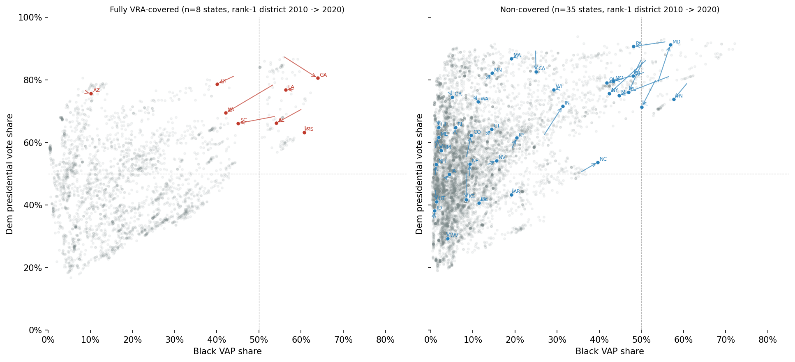

# fairymandering

**Project**: Reorienting ALARM-style simulation metrics toward minority voting power, testing whether post-Shelby maps pack minorities in ways that dodge Gingles thresholds. 

**Results:** We find no significance to packing of Black Voting Age Population (BVAP) post-Shelby, but note the exising and significant packing difference between "fully-covered" states under the Voting Rights Act (VRA) and "non-covered" states. Covered states (requiring preclearance prior to the Shelby decision) pack BVAP voters to a significantly higher margin with regard to neutral simulated plans from the ALARM project and to their non-covered counterparts.

See hosted report [here](v993.github.io/fairymandering/)