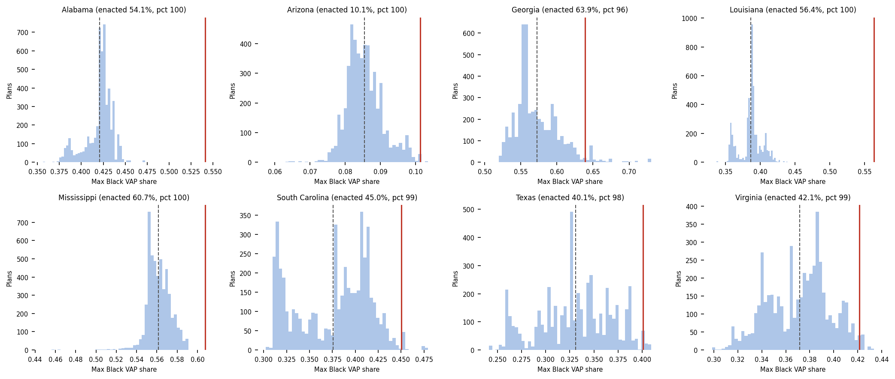

# fairymandering

**In figure**: Simulated "neutral" district Black population maximum across thousands of simulated districting plans in 2020. Neutral plans serve as a baseline for comparison to contextualize true plans [[1](https://alarm-redist.org/)], which are represented as vertical red bars. Each of these are "covered" states under the Voting Rights Act, which had their federal preclearance removed in 2013 with the Shelby decision. This figure serves as a motivating example for this project, as one can visually identify that for all of these states, the true plan's max Black district is far from the neutral simulation distribution- greater than 95th percentile. 

**Goal**: To reorient ALARM-style  simulation metrics toward minority voting power, testing whether post-Shelby maps pack minorities in ways that dodge Gingles thresholds. 

**Results:** We find no significance to packing of Black Voting Age Population (BVAP) post-Shelby, but note the exising and significant packing difference between "fully-covered" states under the Voting Rights Act (VRA) and "non-covered" states. Covered states (requiring preclearance prior to the Shelby decision) pack BVAP voters to a significantly higher margin with regard to neutral simulated plans from the ALARM project and to their non-covered counterparts.

See hosted report [here](v993.github.io/fairymandering/)

## Further work:

- [ ] Comparing covered/non-covered w.r.t neutral simulations (less signal- ALARM Project changed their algorithm to reflect VRA-conscious districting in 2020 only)
- [ ] DiD w.r.t. NOMINATE (minor interest- does NOMINATE respond to Shelby differently across covered/not-covered?). Writing here is also mediocre.
- [ ] Writing refinement